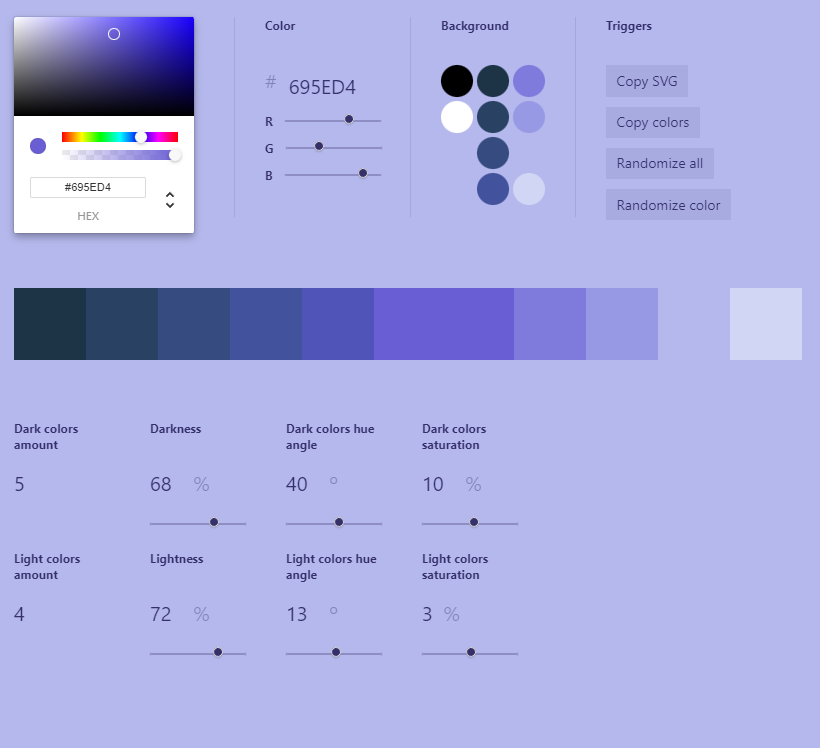
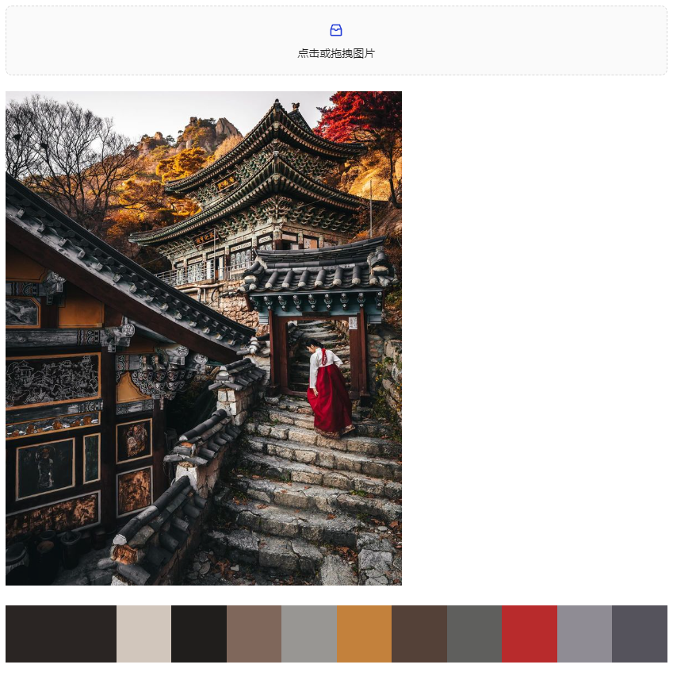

# 概览
这是一个调色板工具，集合了一些我比较喜欢的调色能力

# 功能说明
## 调色板
指定一个颜色，产生不同色调的深色和浅色

## 取色板
分析上传的图片，提取出其中的主要色调

# 安装
暂未上架官方仓库，请先手动安装：
## 方案一
下载release中的zip压缩包，解压后直接解压后的文件夹拖入obsidian插件目录即可
## 方案二
1. 在obsidian插件文件夹中新建一个文件夹，命名为`obsidian-color-palette-tool`  
2. 将本仓库中的`main.js`, `style.css`，`manifest.json`文件复制到上面那个文件夹
3. 安装已成功，在obsidian第三方插件已安装列表中将可以看到`color palette Plugin`,开启即可
4. 开启后，在侧边栏将多出一个调色板按钮，点击工具即出现

# 后续计划
1. 增加快捷命令
2. 在色环右侧增加快照色块 
3. 增加其他配色模式
4. 允许收藏调色板保存为笔记（将会结合这个插件：https://github.com/ALegendsTale/obsidian-color-palette）

# 感谢
Color Scale 来自 https://github.com/hihayk/scale/tree/master
Color Pickers 来自 https://github.com/casesandberg/react-color?tab=readme-ov-file
Color Thief 来自 https://github.com/lokesh/color-thief?tab=readme-ov-file

此外，感谢GPT4O，让我以一个后端开发者的身份毫无难度的完成了这个前端项目
