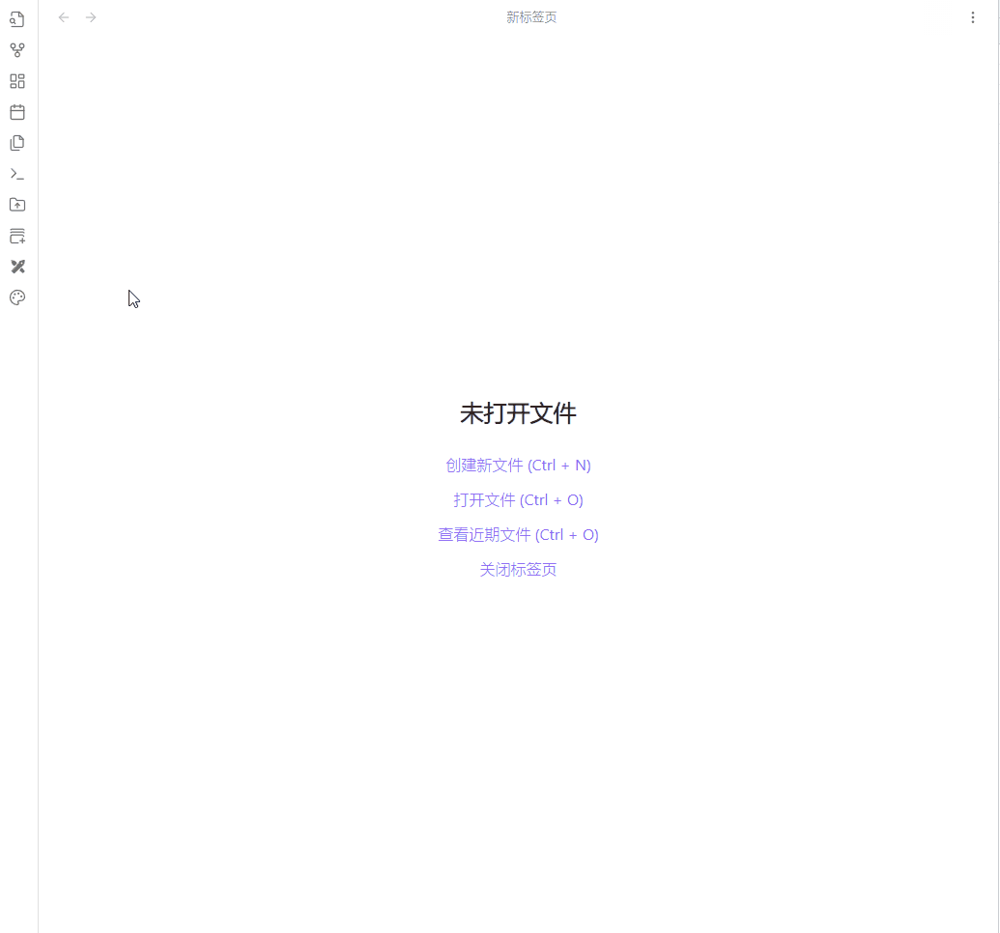

# 概览
这是一个调色板工具，集合了一些我比较喜欢的调色能力

# 功能说明
## 提取主色
分析上传的图片，提取出其中的主要色调，可选择提取的颜色种类，默认提取5种

## 产生相似颜色
输入一个或多个颜色，生成颜色减淡和颜色加深各11种色彩，用于搭配邻近色

## 色环
在HSB色环中选择颜色，并允许复制为hex格式的颜色代码

# 演示

# 安装
暂未上架官方仓库，请先手动安装：    
1. 在obsidian插件文件夹中新建一个文件夹，命名为`obsidian-color-palette-tool`  
2. 将本仓库中的`main.js`, `style.css`，`manifest.json`文件复制到上面那个文件夹
3. 安装已成功，在obsidian第三方插件已安装列表中将可以看到`color palette Plugin`,开启即可
4. 开启后，在侧边栏将多出一个调色板按钮，点击工具即出现

# 后续计划
1. 使用新窗口打开，而不是替换已激活的窗口
2. 增加快捷命令
3. 在色环右侧增加快照色块 
4. 增加其他配色模式
5. 允许收藏调色板保存为笔记（将会结合这个插件：https://github.com/ALegendsTale/obsidian-color-palette）

# 感谢
提取主色算法来自：https://github.com/ppzreboot/k-colors.js/tree/main
产生相似颜色来自：https://github.com/edelstone/tints-and-shades

此外，感谢GPT4O，让我以一个后端开发者的身份毫无难度的完成了这个前端项目
